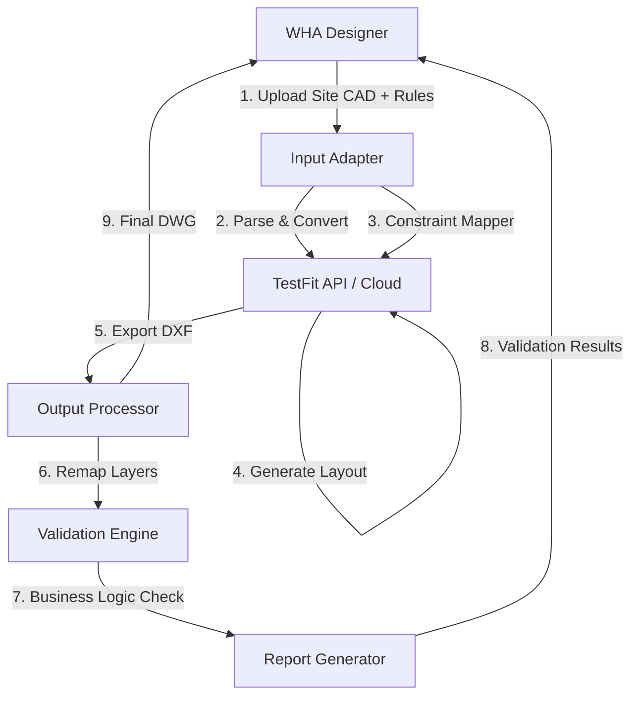

# TECHNICAL ARCHITECTURE: TESTFIT + CUSTOM WRAPPER

## SYSTEM OVERVIEW



## COMPONENT SPECIFICATIONS

### 1. INPUT ADAPTER (Python)

**Purpose:** Convert WHA CAD + constraints → TestFit API format

**Files:**

```python
# input_adapter.py

import ezdxf
from shapely.geometry import Polygon
import json

class InputAdapter:
    """
    Converts WHA input data to TestFit-compatible format
    """
    
    def parse_site_boundary(self, dwg_file_path, layer_name='BOUNDARY-SITE'):
        """
        Extract site boundary polygon from DWG file
        
        Returns: GeoJSON polygon
        """
        doc = ezdxf.readfile(dwg_file_path)
        msp = doc.modelspace()
        
        # Find polyline on boundary layer
        for entity in msp.query(f'LWPOLYLINE[layer=="{layer_name}"]'):
            coords = [(p, p) for p in entity.get_points()] # Note: simplified for illustration
            polygon = Polygon(coords)
            
            # Convert to GeoJSON
            return {
                'type': 'Feature',
                'geometry': {
                    'type': 'Polygon',
                    'coordinates': [list(polygon.exterior.coords)]
                },
                'properties': {
                    'area_sqm': polygon.area,
                    'perimeter_m': polygon.length
                }
            }
        
        raise ValueError(f"No boundary found on layer {layer_name}")
    
    def convert_to_testfit_format(self, site_geojson, constraints):
        """
        Convert to TestFit API payload
        
        TestFit Industrial API expects:
        {
          "site": {
            "boundary": GeoJSON,
            "coordinate_system": "EPSG:32648"
          },
          "constraints": {
            "building_width_range": [min, max],
            "building_depth_range": [min, max],
            "setback_perimeter": meters,
            "road_width": meters,
            "parking_ratio": cars_per_1000sqm
          }
        }
        """
        testfit_payload = {
            'site': {
                'boundary': site_geojson['geometry'],
                'coordinate_system': constraints.get('coordinate_system', 'EPSG:32648')
            },
            'constraints': {
                'building_width_range': [
                    constraints['min_plot_width'], 
                    constraints['max_plot_width']
                ],
                'building_depth_range': [
                    constraints['min_plot_depth'],
                    constraints['max_plot_depth']
                ],
                'setback_perimeter': constraints.get('boundary_setback', 15),
                'road_width_primary': constraints.get('primary_road_width', 24),
                'road_width_secondary': constraints.get('secondary_road_width', 16),
                'lot_coverage_max': constraints.get('max_coverage', 0.60),
                'retention_pond_percentage': constraints.get('pond_percentage', 0.05)
            }
        }
        
        return testfit_payload

# Usage
# adapter = InputAdapter()
# site_boundary = adapter.parse_site_boundary('WHA-RY36_Original.dwg')
```

### 2. CONSTRAINT MAPPER

**Purpose:** Translate WHA planning rules to TestFit parameters

**Files:**

```python
# constraint_mapper.py

class ConstraintMapper:
    """
    Maps WHA constraints to TestFit configuration
    """
    
    WHA_TO_TESTFIT_MAPPING = {
        # WHA constraint name → TestFit parameter name
        'min_plot_size_sqm': ('building_area_min', lambda x: x),
        'max_plot_size_sqm': ('building_area_max', lambda x: x),
        'target_saleable_percentage': ('buildable_area_target', lambda x: x / 100),
        'road_hierarchy': ('road_types', lambda x: {'primary': x['primary_width'], 'secondary': x['secondary_width']}),
        'green_buffer_width_m': ('perimeter_setback', lambda x: x),
        'retention_pond_capacity_m3': ('stormwater_volume', lambda x: x)
    }
    
    def map_constraints(self, wha_constraints):
        """
        Convert WHA constraint dictionary to TestFit parameters
        """
        testfit_params = {}
        
        for wha_key, (testfit_key, transform_fn) in self.WHA_TO_TESTFIT_MAPPING.items():
            if wha_key in wha_constraints:
                testfit_params[testfit_key] = transform_fn(wha_constraints[wha_key])
        
        # Add derived parameters
        testfit_params['optimization_goal'] = 'maximize_building_area'
        testfit_params['parking_config'] = self._calculate_parking(wha_constraints)
        
        return testfit_params
    
    def _calculate_parking(self, wha_constraints):
        return {
            'car_ratio': wha_constraints.get('parking_car_ratio', 0.01),
            'truck_ratio': wha_constraints.get('parking_truck_ratio', 0.002),
            'aisle_width': 7.5
        }
```

### 3. TESTFIT API CLIENT

**Files:**

```python
# testfit_client.py

import requests
import time

class TestFitClient:
    """
    Wrapper for TestFit API
    """
    
    def __init__(self, api_key):
        self.api_key = api_key
        self.base_url = 'https://api.testfit.io/v1'  # Hypothetical
        self.session = requests.Session()
        self.session.headers.update({'Authorization': f'Bearer {api_key}'})
    
    def create_project(self, site_data, constraints):
        payload = {
            'name': f'WHA_POC_{int(time.time())}',
            'typology': 'industrial',
            'site': site_data,
            'parameters': constraints
        }
        
        response = self.session.post(f'{self.base_url}/projects', json=payload)
        response.raise_for_status()
        
        return response.json()['project_id']
    
    def generate_layout(self, project_id, iterations=100):
        # ... (implementation logic)
        return "generation_id_123"
```

### 4. OUTPUT PROCESSOR

**Purpose:** Convert TestFit DXF → WHA-standard DWG

```python
# output_processor.py

import ezdxf
from ezdxf import colors

class OutputProcessor:
    """
    Converts TestFit DXF output to WHA layer standards
    """
    
    WHA_LAYER_MAPPING = {
        'TF-Roads': 'ROAD-PRIMARY-ROW',
        'TF-Buildings': 'PLOTS-BOUNDARY',
        'TF-Parking': 'PARKING-AREAS',
        'TF-Landscaping': 'GREEN-AREAS',
        'TF-Pond': 'RETENTION-POND'
    }
    
    def process(self, testfit_dxf_path, output_dwg_path):
        doc = ezdxf.readfile(testfit_dxf_path)
        msp = doc.modelspace()
        
        self._create_wha_layers(doc)
        
        for entity in msp:
            original_layer = entity.dxf.layer
            if original_layer in self.WHA_LAYER_MAPPING:
                new_layer = self.WHA_LAYER_MAPPING[original_layer]
                entity.dxf.layer = new_layer
        
        doc.saveas(output_dwg_path)
        return output_dwg_path
    
    def _create_wha_layers(self, doc):
        wha_layers = {
            'BOUNDARY-SITE': {'color': colors.MAGENTA, 'linetype': 'CONTINUOUS'},
            'ROAD-PRIMARY-CL': {'color': colors.YELLOW, 'linetype': 'CENTER'},
            'PLOTS-BOUNDARY': {'color': colors.GREEN, 'linetype': 'CONTINUOUS'},
            # ...
        }
        for layer, config in wha_layers.items():
            if layer not in doc.layers:
                doc.layers.new(name=layer, dxfattribs=config)
```

### 5. VALIDATION ENGINE

```python
# validator.py

class LayoutValidator:
    """
    Validates TestFit output against WHA requirements
    """
    
    def validate(self, dxf_path, original_constraints):
        """
        Run all validation checks
        """
        # ... (implementation logic)
        return {'valid': True, 'checks': []}
```

---

## KEY TRADE-OFFS

| Aspect | Custom Build (16 weeks) | TestFit + Wrapper (2 weeks) |
|--------|--------------------------|------------------------------|
| **Development Time** | 16+ weeks | 2 weeks |
| **Cost** | $150K-$300K (team) | $5K-$15K (licenses) |
| **Control** | 100% (your algorithms) | 20% (TestFit black box) |
| **Quality** | Custom-fit to WHA | 80% fit, some compromises |
| **Risk** | High (new development) | Low (proven tool) |

## RECOMMENDATION

✅ **Start with TestFit wrapper (2 weeks)**
✅ **Prove value in POC**
✅ **Then decide:** Continue with TestFit OR build custom
